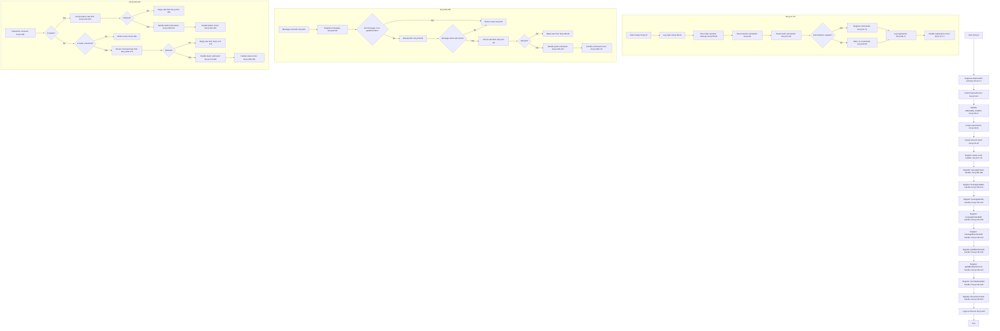

# Bot Core Flowchart

```mermaid
flowchart TD
    A[Start: bot.js:1] --> B[Suppress deprecation warning: bot.js:2-4]
    B --> C[Import dependencies: bot.js:6-24]
    C --> D[Validate DISCORD_TOKEN: bot.js:26-27]
    D --> E[Create rate limiters: bot.js:29-31]
    E --> F[Create Discord client: bot.js:32-45]
    F --> G[Register ready event handler: bot.js:47-78]
    G --> H[Register messageCreate handler: bot.js:80-108]
    H --> I[Register messageUpdate handler: bot.js:110-113]
    I --> J[Register messageDelete handler: bot.js:115-118]
    J --> K[Register messageDeleteBulk handler: bot.js:120-128]
    K --> L[Register messageReactionAdd handler: bot.js:130-133]
    L --> M[Register guildMemberAdd handler: bot.js:135-138]
    M --> N[Register guildMemberRemove handler: bot.js:140-143]
    N --> O[Register voiceStateUpdate handler: bot.js:145-148]
    O --> P[Register interactionCreate handler: bot.js:150-183]
    P --> Q[Login to Discord: bot.js:185]
    Q --> Z[End]

    subgraph Ready Event Handler [bot.js:47-78]
        R1[Client ready: bot.js:47] --> R2[Log login: bot.js:48-49]
        R2 --> R3[Run initial retention cleanup: bot.js:50-55]
        R3 --> R4[Start retention scheduler: bot.js:56]
        R4 --> R5[Read slash commands: bot.js:57-60]
        R5 --> R6{Commands to register?}
        R6 -- Yes --> R7[Register commands: bot.js:61-74]
        R6 -- No --> R8[Warn no commands: bot.js:62-63]
        R7 --> R9[Log registration: bot.js:68,73]
        R8 --> R9
        R9 --> R10[Handle registration errors: bot.js:75-77]
    end

    subgraph Message Create Handler [bot.js:80-108]
        M1[Message received: bot.js:80] --> M2[Snapshot message: bot.js:82-85]
        M2 --> M3{Bot message or no guild/member?}
        M3 -- Yes --> M4[Return early: bot.js:87]
        M3 -- No --> M5[Read prefix: bot.js:89-95]
        M5 --> M6{Message starts with prefix?}
        M6 -- No --> M4
        M6 -- Yes --> M7[Check rate limit: bot.js:97-99]
        M7 --> M8{Allowed?}
        M8 -- No --> M9[Reply rate limit: bot.js:98-99]
        M8 -- Yes --> M10[Handle prefix command: bot.js:103-107]
        M10 --> M11[Handle command errors: bot.js:105-107]
    end

    subgraph Interaction Create Handler [bot.js:150-183]
        I1[Interaction received: bot.js:150] --> I2{Is button?}
        I2 -- Yes --> I3[Check button rate limit: bot.js:153-159]
        I3 --> I4{Allowed?}
        I4 -- No --> I5[Reply rate limit: bot.js:154-159]
        I4 -- Yes --> I6[Handle button interaction: bot.js:160-164]
        I6 --> I7[Handle button errors: bot.js:162-164]
        I2 -- No --> I8{Is slash command?}
        I8 -- No --> I9[Return early: bot.js:168]
        I8 -- Yes --> I10[Check command rate limit: bot.js:169-175]
        I10 --> I11{Allowed?}
        I11 -- No --> I12[Reply rate limit: bot.js:171-175]
        I11 -- Yes --> I13[Handle slash command: bot.js:178-182]
        I13 --> I14[Handle slash errors: bot.js:180-182]
    end
```