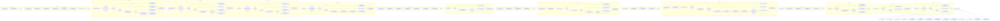

# Configuration System Flowchart

```mermaid
flowchart TD
    A[Start: config.js] --> B[readConfig: config.js:30]
    A --> C[validatePrefix: config.js:39]
    A --> D[readPrefix: config.js:46]
    A --> E[writePrefix: config.js:53]
    A --> F[validateLoggingConfig: config.js:60]
    A --> G[readLoggingConfig: config.js:89]
    A --> H[validateWarningEmbedConfig: config.js:93]
    A --> I[readWarningEmbedConfig: config.js:116]
    A --> J[validateRoleIds: config.js:120]
    A --> K[writeDashboardConfig: config.js:130]
    A --> L[readRoleIds: config.js:151]
    A --> M[readLinks: config.js:178]
    A --> N[readReactionCommands: config.js:196]
    A --> O[readSlashCommands: config.js:204]

    subgraph Read Config [config.js:30-37]
        RC1[Start: readConfig] --> RC2{Read file: config.js:32}
        RC2 --> RC3{File not found?}
        RC3 -->|Yes| RC4[Return empty object: config.js:35]
        RC3 -->|No| RC5{Other error?}
        RC5 -->|Yes| RC6[Throw error: config.js:33-34]
        RC5 -->|No| RC7[Return parsed JSON: config.js:32]
        RC4 --> RC8[End]
        RC6 --> RC8
        RC7 --> RC8
    end

    subgraph Validate Prefix [config.js:39-44]
        VP1[Start: validatePrefix] --> VP2{Not string or empty?}
        VP2 -->|Yes| VP3[Throw error: config.js:40-41]
        VP2 -->|No| VP4{Length > 5?}
        VP4 -->|Yes| VP5[Throw error: config.js:40-41]
        VP4 -->|No| VP6[Return validated prefix: config.js:43]
        VP3 --> VP6
        VP5 --> VP6
    end

    subgraph Read Prefix [config.js:46-51]
        RP1[Start: readPrefix] --> RP2{BOT_PREFIX set?}
        RP2 -->|Yes| RP3[Validate and return BOT_PREFIX: config.js:47-48]
        RP2 -->|No| RP4[Get prefix from config: config.js:49-50]
        RP4 --> RP5{Prefix undefined?}
        RP5 -->|Yes| RP6[Return default '!': config.js:50]
        RP5 -->|No| RP7[Validate and return config prefix: config.js:50-51]
        RP3 --> RP8[End]
        RP6 --> RP8
        RP7 --> RP8
    end

    subgraph Write Prefix [config.js:53-58]
        WP1[Start: writePrefix] --> WP2[Validate prefix: config.js:54-55]
        WP2 --> WP3[Ensure config directory: config.js:55-56]
        WP3 --> WP4[Write updated config: config.js:56-57]
        WP4 --> WP5[Return value: config.js:57-58]
        WP5 --> WP6[End]
    end

    subgraph Validate Logging Config [config.js:60-86]
        VLC1[Start: validateLoggingConfig] --> VLC2[Extract logging object: config.js:62]
        VLC2 --> VLC3[Get channelId: config.js:63]
        VLC3 --> VLC4{Invalid channelId?}
        VLC4 -->|Yes| VLC5[Throw error: config.js:67-68]
        VLC4 -->|No| VLC6[Get retentionDays: config.js:64]
        VLC6 --> VLC7{Invalid retentionDays?}
        VLC7 -->|Yes| VLC8[Throw error: config.js:70-71]
        VLC7 -->|No| VLC9[Get deliverySource: config.js:65]
        VLC9 --> VLC10[Get colorSource: config.js:66]
        VLC10 --> VLC11[Build delivery object: config.js:74-75]
        VLC11 --> VLC12[Build colors object: config.js:76-81]
        VLC12 --> VLC13{No channelId but delivery enabled?}
        VLC13 -->|Yes| VLC14[Throw error: config.js:82-84]
        VLC13 -->|No| VLC15[Return config object: config.js:86]
        VLC5 --> VLC15
        VLC8 --> VLC15
        VLC14 --> VLC15
    end

    subgraph Read Logging Config [config.js:89-91]
        RLC1[Start: readLoggingConfig] --> RLC2[Get logging from config: config.js:90]
        RLC2 --> RLC3[Validate logging config: config.js:90-91]
        RLC3 --> RLC4[Return validated config: config.js:91]
        RLC4 --> RLC5[End]
    end

    subgraph Validate Warning Embed Config [config.js:93-113]
        VWEC1[Start: validateWarningEmbedConfig] --> VWEC2[Get warningEmbed or default: config.js:94-95]
        VWEC2 --> VWEC3[Extract color: config.js:95]
        VWEC3 --> VWEC4{Invalid color?}
        VWEC4 -->|Yes| VWEC5[Throw error: config.js:99-100]
        VWEC4 -->|No| VWEC6[Extract title: config.js:96]
        VWEC6 --> VWEC7{Invalid title?}
        VWEC7 -->|Yes| VWEC8[Throw error: config.js:102-103]
        VWEC7 -->|No| VWEC9[Extract message: config.js:97]
        VWEC9 --> VWEC10{Invalid message?}
        VWEC10 -->|Yes| VWEC11[Throw error: config.js:105-106]
        VWEC10 -->|No| VWEC12[Return validated config: config.js:110-113]
        VWEC5 --> VWEC12
        VWEC8 --> VWEC12
        VWEC11 --> VWEC12
    end

    subgraph Read Warning Embed Config [config.js:116-118]
        RWEC1[Start: readWarningEmbedConfig] --> RWEC2[Get warningEmbed from config: config.js:117]
        RWEC2 --> RWEC3[Validate warning embed config: config.js:117-118]
        RWEC3 --> RWEC4[Return validated config: config.js:118]
        RWEC4 --> RWEC5[End]
    end

    subgraph Validate Role IDs [config.js:120-127]
        VRI1[Start: validateRoleIds] --> VRI2{Not array?}
        VRI2 -->|Yes| VRI3[Throw error: config.js:121]
        VRI2 -->|No| VRI4[Normalize role IDs: config.js:123-124]
        VRI4 --> VRI5{Invalid role ID format?}
        VRI5 -->|Yes| VRI6[Throw error: config.js:124-126]
        VRI5 -->|No| VRI7[Return normalized IDs: config.js:127]
        VRI3 --> VRI7
        VRI6 --> VRI7
    end

    subgraph Write Dashboard Config [config.js:130-148]
        WDC1[Start: writeDashboardConfig] --> WDC2[Validate all inputs: config.js:131-136]
        WDC2 --> WDC3[Build saved object: config.js:131-137]
        WDC3 --> WDC4[Build persisted object: config.js:138-144]
        WDC4 --> WDC5[Ensure config directory: config.js:145-146]
        WDC5 --> WDC6[Write config file: config.js:146-147]
        WDC6 --> WDC7[Return saved object: config.js:147-148]
        WDC7 --> WDC8[End]
    end

    subgraph Read Role IDs [config.js:151-175]
        RRI1[Start: readRoleIds] --> RRI2{Read config: config.js:153-154}
        RRI2 --> RRI3{File not found?}
        RRI3 -->|Yes| RRI4[Return empty role IDs: config.js:174-175]
        RRI3 -->|No| RRI5{Other error?}
        RRI5 -->|Yes| RRI6[Throw error: config.js:155]
        RRI5 -->|No| RRI7[Get moderatorRoleId: config.js:155-156]
        RRI7 --> RRI8[Convert to array if string: config.js:156-159]
        RRI8 --> RRI9[Get adminRoleId: config.js:162-163]
        RRI9 --> RRI10[Convert to array if string: config.js:163-166]
        RRI10 --> RRI11[Return role IDs: config.js:169-171]
        RRI4 --> RRI11
        RRI6 --> RRI11
    end

    subgraph Read Links [config.js:178-193]
        RL1[Start: readLinks] --> RL2{Read config: config.js:180-181}
        RL2 --> RL3{File not found?}
        RL3 -->|Yes| RL4[Return empty array: config.js:191-192]
        RL3 -->|No| RL5{Other error?}
        RL5 -->|Yes| RL6[Throw error: config.js:182]
        RL5 -->|No| RL7[Get links array: config.js:181]
        RL7 --> RL8{Not array?}
        RL8 -->|Yes| RL9[Return empty array: config.js:183]
        RL8 -->|No| RL10[Filter valid links: config.js:183-189]
        RL10 --> RL11[Return filtered links: config.js:190]
        RL4 --> RL11
        RL6 --> RL11
        RL9 --> RL11
    end

    subgraph Read Reaction Commands [config.js:196-202]
        RRC1[Start: readReactionCommands] --> RRC2{Read config: config.js:197-198}
        RRC2 --> RRC3{File not found?}
        RRC3 -->|Yes| RRC4[Return empty object: config.js:201-202]
        RRC3 -->|No| RRC5{Other error?}
        RRC5 -->|Yes| RRC6[Throw error: config.js:199]
        RRC5 -->|No| RRC7[Get reactionCommands: config.js:197]
        RRC7 --> RRC8{Not object or is array?}
        RRC8 -->|Yes| RRC9[Return empty object: config.js:200]
        RRC8 -->|No| RRC10[Filter valid entries: config.js:199-201]
        RRC10 --> RRC11[Return filtered commands: config.js:201]
        RRC4 --> RRC11
        RRC6 --> RRC11
        RRC9 --> RRC11
    end

    subgraph Read Slash Commands [config.js:204-287]
        RSC1[Start: readSlashCommands] --> RSC2{Read config: config.js:206-207}
        RSC2 --> RSC3{File not found?}
        RSC3 -->|Yes| RSC4[Use default commands: config.js:216-217]
        RSC3 -->|No| RSC5{Other error?}
        RSC5 -->|Yes| RSC6[Log error and use defaults: config.js:213-217]
        RSC5 -->|No| RSC7[Get slashCommands: config.js:207]
        RSC7 --> RSC8{Not array?}
        RSC8 -->|Yes| RSC9[Log error and use defaults: config.js:210-217]
        RSC8 -->|No| RSC10[Filter out built-in commands: config.js:208-209]
        RSC10 --> RSC11[Add built-in slash commands: config.js:221-273]
        RSC11 --> RSC12[Return combined commands: config.js:274]
        RSC4 --> RSC12
        RSC6 --> RSC12
        RSC9 --> RSC12
    end

    subgraph Add Built-in Slash Commands [config.js:221-273]
        ABS1[Start: addBuiltInSlashCommands] --> ABS2[Create kick command: config.js:222-232]
        ABS2 --> ABS3[Create logs command: config.js:234-245]
        ABS3 --> ABS4[Create warn command: config.js:247-257]
        ABS4 --> ABS5[Create infractions command: config.js:259-265]
        ABS5 --> ABS6[Filter and combine: config.js:267-273]
        ABS6 --> ABS7[Return result: config.js:274]
        ABS7 --> ABS8[End]
    end

    subgraph Get Default Slash Commands [config.js:276-286]
        GDSC1[Start: getDefaultSlashCommands] --> GDSC2[Return default commands: config.js:277-286]
        GDSC2 --> GDSC3[End]
    end
```