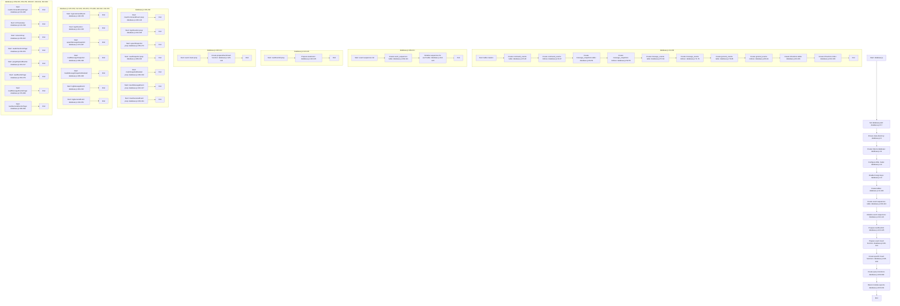

# Database Layer Flowchart

```mermaid
flowchart TD
    A[Start: database.js] --> B[Set database path: database.js:5-7]
    B --> C[Ensure data directory: database.js:9]
    C --> D[Create SQLite database: database.js:11]
    D --> E[Configure WAL mode: database.js:12]
    E --> F[Enable foreign keys: database.js:13]
    F --> G[Create tables: database.js:14-104]
    G --> H[Create event sequences table: database.js:109-113]
    H --> I[Initialize event sequences: database.js:114-121]
    I --> J[Prepare nextEventId: database.js:123-126]
    J --> K[Prepare event insert function: database.js:128-134]
    K --> L[Create specific insert functions: database.js:135-228]
    L --> M[Create query functions: database.js:229-399]
    M --> N[Return module exports: database.js:420-434]
    N --> Z[End]

    subgraph Table Creation [database.js:14-104]
        TC1[Start: table creation] --> TC2[Create command_events table: database.js:15-28]
        TC2 --> TC3[Create command_events indices: database.js:30-37]
        TC3 --> TC4[Create message_snapshots table: database.js:39-50]
        TC4 --> TC5[Create message_snapshots indices: database.js:52-55]
        TC5 --> TC6[Create message_events table: database.js:57-69]
        TC6 --> TC7[Create message_events indices: database.js:71-76]
        TC7 --> TC8[Create general_events table: database.js:78-86]
        TC8 --> TC9[Create general_events indices: database.js:89-91]
        TC9 --> TC10[Create infractions table: database.js:93-101]
        TC10 --> TC11[Create infractions index: database.js:102-103]
        TC11 --> TC12[End]
    end

    subgraph Event Sequences Initialization [database.js:109-121]
        ESI1[Start: event sequences init] --> ESI2[Create event_sequences table: database.js:109-113]
        ESI2 --> ESI3[Initialize sequences for each table: database.js:114-120]
        ESI3 --> ESI4[End]
    end

    subgraph Next Event ID Preparation [database.js:123-126]
        NEID1[Start: nextEventId prep] --> NEID2[Prepare statement: database.js:123-126]
        NEID2 --> NEID3[End]
    end

    subgraph Event Insert Preparation [database.js:128-134]
        EIP1[Start: event insert prep] --> EIP2[Create prepareEventInsert function: database.js:128-134]
        EIP2 --> EIP3[End]
    end

    subgraph Specific Insert Functions [database.js:135-228]
        SIF1[Start: insertCommandEvent prep: database.js:136-144] --> SIF2[End]
        SIF3[Start: logInfraction prep: database.js:212-228] --> SIF4[End]
        SIF5[Start: upsertSnapshot prep: database.js:255-272] --> SIF6[End]
        SIF7[Start: readSnapshot prep: database.js:289-294] --> SIF8[End]
        SIF9[Start: markSnapshotDeleted prep: database.js:300-304] --> SIF10[End]
        SIF11[Start: insertMessageEvent prep: database.js:310-317] --> SIF12[End]
        SIF13[Start: insertGeneralEvent prep: database.js:335-341] --> SIF14[End]
    end

    subgraph Logging Functions [database.js:145-158, 212-228, 229-253, 273-288, 318-332, 342-351]
        LF1[Start: logCommandEvent: database.js:146-158] --> LF2[End]
        LF3[Start: logInfraction: database.js:212-228] --> LF4[End]
        LF5[Start: upsertMessageSnapshot: database.js:274-287] --> LF6[End]
        LF7[Start: readMessageSnapshot: database.js:295-298] --> LF8[End]
        LF9[Start: markMessageSnapshotDeleted: database.js:305-308] --> LF10[End]
        LF11[Start: logMessageEvent: database.js:319-332] --> LF12[End]
        LF13[Start: logGeneralEvent: database.js:343-351] --> LF14[End]
    end

    subgraph Query Functions [database.js:159-210, 254-253, 289-317, 333-341, 352-399]
        QF1[Start: readCommandEventsPage: database.js:161-188] --> QF2[End]
        QF3[Start: toTimestamp: database.js:191-198] --> QF4[End]
        QF5[Start: toJsonArray: database.js:200-202] --> QF6[End]
        QF7[Start: readInfractionsPage: database.js:230-253] --> QF8[End]
        QF9[Start: purgeExpiredEvents: database.js:401-417] --> QF10[End]
        QF11[Start: readEventsPage: database.js:354-376] --> QF12[End]
        QF13[Start: readMessageEventsPage: database.js:379-388] --> QF14[End]
        QF15[Start: readGeneralEventsPage: database.js:390-399] --> QF16[End]
    end
```