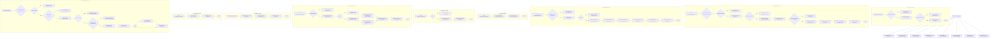

# Event Logging System Flowchart

```mermaid
flowchart TD
    A[Start: event-logging.js] --> B[snapshotMessage: event-logging.js:96]
    A --> C[handleMessageUpdate: event-logging.js:103]
    A --> D[handleMessageDelete: event-logging.js:142]
    A --> E[handleMemberJoin: event-logging.js:188]
    A --> F[handleMemberLeave: event-logging.js:192]
    A --> G[handleVoiceStateUpdate: event-logging.js:196]
    A --> H[runRetentionCleanup: event-logging.js:312]
    A --> I[startRetentionScheduler: event-logging.js:317]

    subgraph Snapshot Message [event-logging.js:96-101]
        SM1[Start: snapshotMessage] --> SM2{No guild or bot author?}
        SM2 -->|Yes| SM3[Return early: event-logging.js:97-98]
        SM2 -->|No| SM4[Create message data: event-logging.js:99]
        SM4 --> SM5{Valid message/guild IDs?}
        SM5 -->|No| SM6[Return early: event-logging.js:99-100]
        SM5 -->|Yes| SM7[Upsert snapshot: event-logging.js:100]
        SM7 --> SM8[End]
    end

    subgraph Handle Message Update [event-logging.js:103-140]
        HMU1[Start: handleMessageUpdate] --> HMU2{Fetch partial if needed: event-logging.js:104-111}
        HMU2 --> HMU3{No guild or bot author?}
        HMU3 -->|Yes| HMU4[Return early: event-logging.js:114-115]
        HMU3 -->|No| HMU5[Create current data: event-logging.js:116]
        HMU5 --> HMU6{Valid message/guild IDs?}
        HMU6 -->|No| HMU7[Return early: event-logging.js:117-118]
        HMU6 -->|Yes| HMU8[Read stored snapshot: event-logging.js:119]
        HMU8 --> HMU9[Create before data: event-logging.js:120]
        HMU9 --> HMU10{Content or attachments changed?}
        HMU10 -->|No| HMU11[Return early: event-logging.js:121]
        HMU10 -->|Yes| HMU12[Create event object: event-logging.js:123-136]
        HMU12 --> HMU13[Log message event: event-logging.js:137]
        HMU13 --> HMU14[Upsert current snapshot: event-logging.js:138]
        HMU14 --> HMU15[Deliver log event: event-logging.js:139]
        HMU15 --> HMU16[End]
    end

    subgraph Handle Message Delete [event-logging.js:142-167]
        HMD1[Start: handleMessageDelete] --> HMD2{No guild, bot author, or message ID?}
        HMD2 -->|Yes| HMD3[Return early: event-logging.js:143-146]
        HMD2 -->|No| HMD4[Get guild ID: event-logging.js:145]
        HMD4 --> HMD5{No guild ID?}
        HMD5 -->|Yes| HMD6[Return early: event-logging.js:146-147]
        HMD5 -->|No| HMD7[Read stored snapshot: event-logging.js:147]
        HMD7 --> HMD8[Create before data: event-logging.js:148]
        HMD8 --> HMD9[Create event object: event-logging.js:150-162]
        HMD9 --> HMD10[Log message event: event-logging.js:164]
        HMD10 --> HMD11[Mark snapshot deleted: event-logging.js:165]
        HMD11 --> HMD12[Deliver log event: event-logging.js:166]
        HMD12 --> HMD13[End]
    end

    subgraph Handle Member Join/Leave [event-logging.js:188-194]
        HMJL1[Start: handleMemberJoin/Leave] --> HMJL2[Create member event: event-logging.js:189,193]
        HMJL2 --> HMJL3[Store and deliver general: event-logging.js:190,194]
        HMJL3 --> HMJL4[End]
    end

    subgraph Store and Deliver General [event-logging.js:182-186]
        SDG1[Start: storeAndDeliverGeneral] --> SDG2{No event?}
        SDG2 -->|Yes| SDG3[Return early: event-logging.js:183]
        SDG2 -->|No| SDG4[Log general event: event-logging.js:184]
        SDG4 --> SDG5[Deliver log event: event-logging.js:185]
        SDG5 --> SDG6[End]
    end

    subgraph Handle Voice State Update [event-logging.js:196-229]
        HSVU1[Start: handleVoiceStateUpdate] --> HSVU2{No channel change?}
        HSVU2 -->|Yes| HSVU3[Return early: event-logging.js:199]
        HSVU2 -->|No| HSVU4[Extract channel IDs: event-logging.js:197-199]
        HSVU4 --> HSVU5{No guild ID?}
        HSVU5 -->|Yes| HSVU6[Return early: event-logging.js:202-203]
        HSVU5 -->|No| HSVU7[Create base event: event-logging.js:205-210]
        HSVU7 --> HSVU8[Create voice leave event if old channel: event-logging.js:211-218]
        HSVU7 --> HSVU9[Create voice join event if new channel: event-logging.js:219-226]
        HSVU8 --> HSVU10[Log general events: event-logging.js:227]
        HSVU9 --> HSVU10
        HSVU10 --> HSVU11[Deliver log events: event-logging.js:228]
        HSVU11 --> HSVU12[End]
    end

    subgraph Run Retention Cleanup [event-logging.js:312-315]
        RRC1[Start: runRetentionCleanup] --> RRC2[Get retention days: event-logging.js:313]
        RRC2 --> RRC3[Purge expired events: event-logging.js:314]
        RRC3 --> RRC4[Return result: event-logging.js:314]
        RRC4 --> RRC5[End]
    end

    subgraph Start Retention Scheduler [event-logging.js:317-326]
        SRS1[Start: startRetentionScheduler] --> SRS2[Set interval: event-logging.js:318-324]
        SRS2 --> SRS3[Return timer: event-logging.js:325]
        SRS3 --> SRS4[End]
    end

    subgraph Deliver Log Event [event-logging.js:275-310]
        DLE1[Start: deliverLogEvent] --> DLE2{Get config key: event-logging.js:276-278}
        DLE2 --> DLE3{Delivery disabled?}
        DLE3 -->|Yes| DLE4[Return false: event-logging.js:279-280]
        DLE3 -->|No| DLE5{Guild channels unavailable?}
        DLE5 -->|Yes| DLE6[Warn and return false: event-logging.js:281-283]
        DLE5 -->|No| DLE7[Get channel: event-logging.js:286-289]
        DLE7 --> DLE8{Channel not found?}
        DLE8 -->|Yes| DLE9[Warn and return false: event-logging.js:290-292]
        DLE8 -->|No| DLE10{Channel not text-based/sendable?}
        DLE10 -->|Yes| DLE11[Warn and return false: event-logging.js:293-299]
        DLE10 -->|No| DLE12[Send embed: event-logging.js:302-304]
        DLE12 --> DLE13[Return true: event-logging.js:305]
        DLE13 --> DLE14{Error?}
        DLE14 -->|Yes| DLE15[Log error: event-logging.js:306-308]
        DLE15 --> DLE16[Return false: event-logging.js:309]
        DLE14 -->|No| DLE16
    end
```