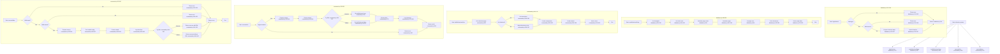

# Infraction System Flowchart

```mermaid
flowchart TD
    A[Start: infraction system] --> B[logInfraction: database.js:212]
    A --> C[readInfractionsPage: database.js:230]
    A --> D[buildInfractionsView: commands.js:284]
    A --> E[executeKick: commands.js:259]
    A --> F[executeWarn: commands.js:321]

    subgraph Log Infraction [database.js:212-228]
        LI1[Start: logInfraction] --> LI2{Valid type?}
        LI2 -->|No| LI3[Throw error: database.js:213-215]
        LI2 -->|Yes| LI4{Valid reason?}
        LI4 -->|No| LI5[Throw error: database.js:216-218]
        LI4 -->|Yes| LI6[Prepare infraction data: database.js:220-227]
        LI6 --> LI7[Insert infraction: database.js:220-227]
        LI7 --> LI8[Return: database.js:228]
        LI3 --> LI8
        LI5 --> LI8
    end

    subgraph Read Infractions Page [database.js:230-253]
        RIP1[Start: readInfractionsPage] --> RIP2[Get throughId: database.js:231-235]
        RIP2 --> RIP3[Get total count: database.js:236-240]
        RIP3 --> RIP4[Calculate page count: database.js:241]
        RIP4 --> RIP5[Normalize page: database.js:242-243]
        RIP5 --> RIP6[Get page size: database.js:244]
        RIP6 --> RIP7[Fetch infractions: database.js:245-250]
        RIP7 --> RIP8[Return page data: database.js:251-252]
        RIP8 --> RIP9[End]
    end

    subgraph Build Infractions View [commands.js:284-312]
        BIV1[Start: buildInfractionsView] --> BIV2[Get infractions page: commands.js:285]
        BIV2 --> BIV3{No infractions?}
        BIV3 -->|Yes| BIV4[Set description: commands.js:286-288]
        BIV3 -->|No| BIV5[Map infractions to text: commands.js:289-290]
        BIV4 --> BIV6[Create components: commands.js:292-303]
        BIV5 --> BIV6
        BIV6 --> BIV7[Create embed: commands.js:304-309]
        BIV7 --> BIV8[Return view: commands.js:310-312]
        BIV8 --> BIV9[End]
    end

    subgraph Execute Kick [commands.js:259-282]
        EK1[Start: executeKick] --> EK2{Target kickable?}
        EK2 -->|No| EK3[Return error: commands.js:260]
        EK2 -->|Yes| EK4[Prepare reason: commands.js:262-263]
        EK4 --> EK5[Create embed: commands.js:264-266]
        EK5 --> EK6{Try DM: commands.js:268-271}
        EK6 -->|Success| EK7[Set dmDelivered: true: commands.js:269]
        EK6 -->|Failure| EK8[Set dmDelivered: false: commands.js:270-271]
        EK7 --> EK9[Perform kick: commands.js:272]
        EK8 --> EK9
        EK9 --> EK10[Log infraction: commands.js:274-280]
        EK10 --> EK11[Return result: commands.js:281]
        EK3 --> EK11
    end

    subgraph Execute Warn [commands.js:321-347]
        EW1[Start: executeWarn] --> EW2{Valid target?}
        EW2 -->|No| EW3[Throw error: commands.js:322-323]
        EW2 -->|Yes| EW4{Valid reason?}
        EW4 -->|No| EW5[Throw error: commands.js:324-325]
        EW4 -->|Yes| EW6[Prepare reason: commands.js:325-326]
        EW6 --> EW7[Get embed config: commands.js:326-327]
        EW7 --> EW8[Create embed: commands.js:328-331]
        EW8 --> EW9[Log infraction: commands.js:333-339]
        EW9 --> EW10{Try DM: commands.js:341-346}
        EW10 -->|Success| EW11[Return success with DM: commands.js:342-343]
        EW10 -->|Failure| EW12[Return success without DM: commands.js:344-346]
        EW3 --> EW13[Return error]
        EW5 --> EW13
        EW11 --> EW13
        EW12 --> EW13
        EW13 --> EW14[End]
    end
```