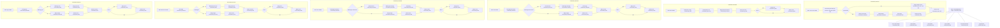

# Moderation Commands Flowchart

```mermaid
flowchart TD
    A[Start: commandHandlers object: commands.js:405] --> B[server-info handler: commands.js:406]
    A --> C[links handler: commands.js:463]
    A --> D[kick handler: commands.js:487]
    A --> E[warn handler: commands.js:533]
    A --> F[infractions handler: commands.js:567]
    A --> G[logs handler: commands.js:593]

    subgraph Server Info Handler [commands.js:406-461]
        SI1[Start: server-info handler] --> SI2[Determine guild and reply method: commands.js:409-425]
        SI2 --> SI3{G guild valid?}
        SI3 -->|No| SI4[Reply invalid context: commands.js:415-417, 422-424]
        SI3 -->|Yes| SI5[Gather server data: commands.js:428-431]
        SI5 --> SI6[Build embed: commands.js:436-448]
        SI6 --> SI7[Send reply: commands.js:454]
        SI7 --> SI8[Return success: commands.js:455]
        SI4 --> SI9[Return error: commands.js:418, 425]
        SI8 --> SI9
    end

    subgraph Links Handler [commands.js:463-485]
        L1[Start: links handler] --> L2[Read links config: commands.js:465]
        L2 --> L3[Create button row: commands.js:467-473]
        L3 --> L4[Reply with link selection: commands.js:475-479]
        L4 --> L5[Return success: commands.js:480]
        L5 --> L6{Error?}
        L6 -->|Yes| L7[Reply error: commands.js:482]
        L7 --> L8[Return error: commands.js:484]
        L6 -->|No| L8
    end

    subgraph Kick Handler [commands.js:487-531]
        K1[Start: kick handler] --> K2[Get target and reason: commands.js:489-497]
        K2 --> K3{Valid target and reason?}
        K3 -->|No| K4[Reply usage: commands.js:503-505]
        K4 --> K5[Return error: commands.js:506]
        K3 -->|Yes| K6[Execute kick: commands.js:507-512]
        K6 --> K7[Build reply message: commands.js:513-517]
        K7 --> K8[Send reply: commands.js:518-522]
        K8 --> K9[Return result: commands.js:523]
        K5 --> K9
        K9 --> K10{Error?}
        K10 -->|Yes| K11[Reply error: commands.js:526]
        K11 --> K12[Return error: commands.js:529]
        K10 -->|No| K12
    end

    subgraph Warn Handler [commands.js:533-565]
        W1[Start: warn handler] --> W2[Get target and reason: commands.js:535-540]
        W2 --> W3{Valid target and reason?}
        W3 -->|No| W4[Reply usage: commands.js:545-547]
        W4 --> W5[Return error: commands.js:548]
        W3 -->|Yes| W6[Execute warn: commands.js:552-556]
        W6 --> W7[Build reply message: commands.js:554-556]
        W7 --> W8[Send reply: commands.js:557-559]
        W8 --> W9[Return result: commands.js:560]
        W5 --> W9
        W9 --> W10{Error?}
        W10 -->|Yes| W11[Reply error: commands.js:562]
        W11 --> W12[Return error: commands.js:564]
        W10 -->|No| W12
    end

    subgraph Infractions Handler [commands.js:567-591]
        I1[Start: infractions handler] --> I2[Get target: commands.js:569-571]
        I2 --> I3{Valid target?}
        I3 -->|No| I4[Reply usage: commands.js:575-577]
        I4 --> I5[Return error: commands.js:578]
        I3 -->|Yes| I6[Build infraction view: commands.js:582]
        I6 --> I7[Reply with view: commands.js:583]
        I7 --> I8[Return success: commands.js:584]
        I5 --> I8
        I8 --> I9{Error?}
        I9 -->|Yes| I10[Reply error: commands.js:586]
        I10 --> I11[Return error: commands.js:589]
        I9 -->|No| I11
    end

    subgraph Logs Handler [commands.js:593-616]
        Lo1[Start: logs handler] --> Lo2[Get log type: commands.js:595-598]
        Lo2 --> Lo3{Valid log type?}
        Lo3 -->|No| Lo4[Reply usage: commands.js:603-605]
        Lo4 --> Lo5[Return error: commands.js:606]
        Lo3 -->|Yes| Lo6[Build log view: commands.js:608]
        Lo6 --> Lo7[Reply with view: commands.js:609]
        Lo7 --> Lo8[Return success: commands.js:610]
        Lo5 --> Lo8
        Lo8 --> Lo9{Error?}
        Lo9 -->|Yes| Lo10[Reply error: commands.js:612]
        Lo10 --> Lo11[Return error: commands.js:615]
        Lo9 -->|No| Lo11
    end
```