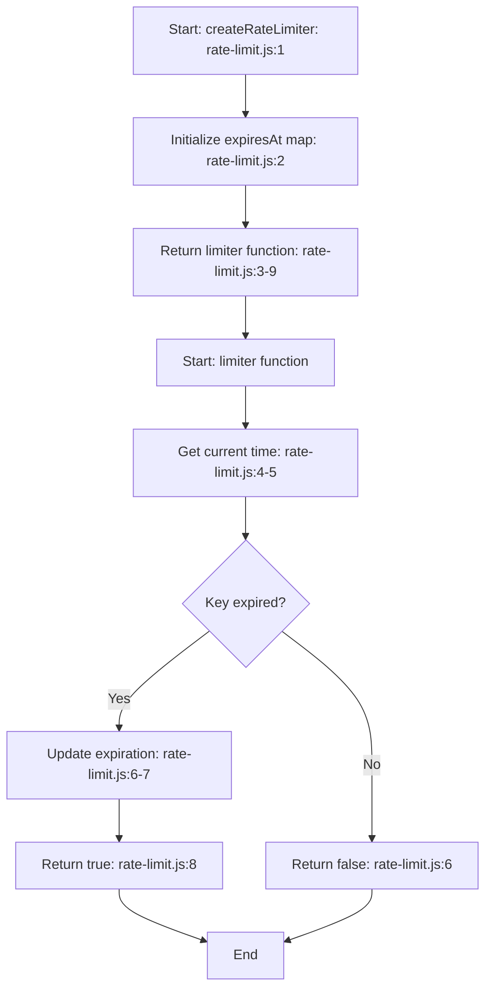
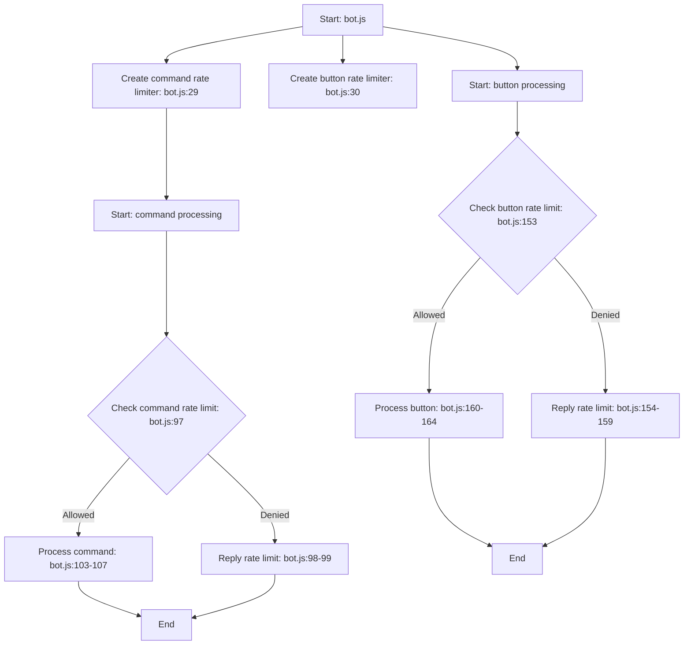

# Rate Limiting Flowchart

```mermaid
flowchart TD
    A[Start: createRateLimiter: rate-limit.js:1] --> B[Initialize expiresAt map: rate-limit.js:2]
    B --> C[Return limiter function: rate-limit.js:3-9]
    C --> D[Start: limiter function]
    D --> E[Get current time: rate-limit.js:4-5]
    E --> F{Key expired?}
    F -->|Yes| G[Update expiration: rate-limit.js:6-7]
    G --> H[Return true: rate-limit.js:8]
    F -->|No| I[Return false: rate-limit.js:6]
    H --> J[End]
    I --> J
```

## Usage in Bot

```mermaid
flowchart TD
    A[Start: bot.js] --> B[Create command rate limiter: bot.js:29]
    A --> C[Create button rate limiter: bot.js:30]
    B --> D[Start: command processing]
    D --> E{Check command rate limit: bot.js:97}
    E -->|Allowed| F[Process command: bot.js:103-107]
    E -->|Denied| G[Reply rate limit: bot.js:98-99]
    F --> H[End]
    G --> H
    A --> I[Start: button processing]
    I --> J{Check button rate limit: bot.js:153}
    J -->|Allowed| K[Process button: bot.js:160-164]
    J -->|Denied| L[Reply rate limit: bot.js:154-159]
    K --> M[End]
    L --> M
```