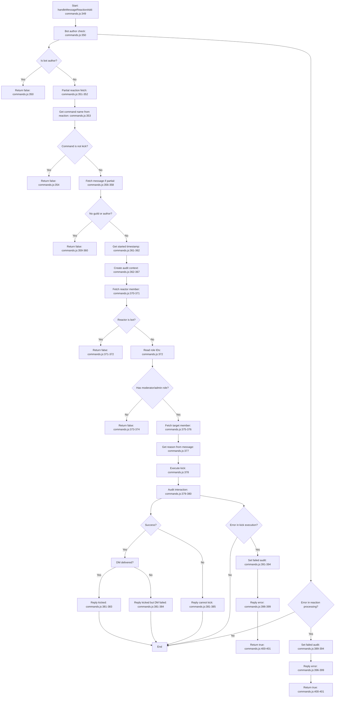

# Reaction Commands Flowchart

```mermaid
flowchart TD
    A[Start: handleMessageReactionAdd: commands.js:349] --> B[Bot author check: commands.js:350]
    B --> C{Is bot author?}
    C -->|Yes| D[Return false: commands.js:350]
    C -->|No| E[Partial reaction fetch: commands.js:351-352]
    E --> F[Get command name from reaction: commands.js:353]
    F --> G{Command is not kick?}
    G -->|Yes| H[Return false: commands.js:354]
    G -->|No| I[Fetch message if partial: commands.js:356-358]
    I --> J{No guild or author?}
    J -->|Yes| K[Return false: commands.js:359-360]
    J -->|No| L[Get started timestamp: commands.js:361-362]
    L --> M[Create audit context: commands.js:362-367]
    M --> N[Fetch reactor member: commands.js:370-371]
    N --> O{Reactor is bot?}
    O -->|Yes| P[Return false: commands.js:371-372]
    O -->|No| Q[Read role IDs: commands.js:372]
    Q --> R{Has moderator/admin role?}
    R -->|No| S[Return false: commands.js:373-374]
    R -->|Yes| T[Fetch target member: commands.js:375-376]
    T --> U[Get reason from message: commands.js:377]
    U --> V[Execute kick: commands.js:378]
    V --> W[Audit interaction: commands.js:379-380]
    W --> X{Success?}
    X -->|Yes| Y[DM delivered?]
    Y -->|Yes| Z[Reply kicked: commands.js:381-383]
    Y -->|No| AA[Reply kicked but DM failed: commands.js:381-384]
    X -->|No| AB[Reply cannot kick: commands.js:381-385]
    Z --> AC[End]
    AA --> AC
    AB --> AC
    W --> AD{Error in kick execution?}
    AD -->|Yes| AE[Set failed audit: commands.js:391-394]
    AE --> AF[Reply error: commands.js:396-399]
    AF --> AG[Return true: commands.js:400-401]
    AD -->|No| AC
    B --> AH{Error in reaction processing?}
    AH -->|Yes| AI[Set failed audit: commands.js:389-394]
    AI --> AJ[Reply error: commands.js:396-399]
    AJ --> AK[Return true: commands.js:400-401]
    AH -->|No| AC
```