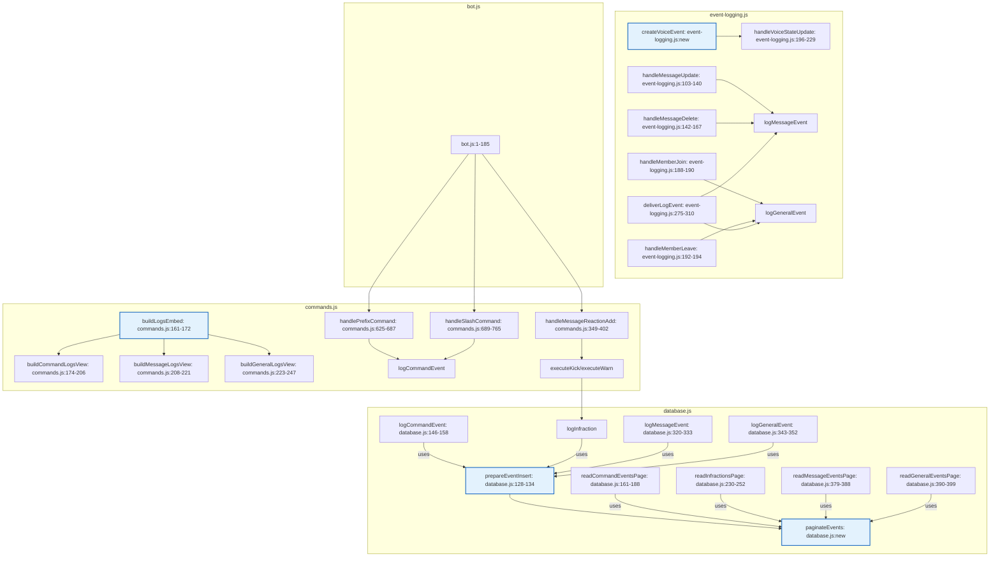

# Unified Proposal

## 1. Voice Event Helper Function (Within-Feature Duplication)

**Concern**: Duplicate code blocks in `handleVoiceStateUpdate` for creating voice leave and voice join events.

**Proposal**: Extract a helper function `createVoiceEvent(base, type, channelId)` that returns the event object.

**Unified Component**: 
- New function: `createVoiceEvent` in `event-logging.js`
- Signature: `(base, type, channelId) => { ... }`

**What each old call site becomes**:
- Old voice leave block (lines 211-218) becomes: `events.push(createVoiceEvent(base, 'voice_leave', String(oldChannelId)));`
- Old voice join block (lines 219-226) becomes: `events.push(createVoiceEvent(base, 'voice_join', String(newChannelId)));`

**Loss of Capability**: None. The helper function produces identical objects.

## 2. Generic Pagination Function (Cross-Feature Duplication)

**Concern**: Duplicated pagination logic in `readCommandEventsPage` and `readInfractionsPage`.

**Proposal**: Create a generic pagination function `paginateEvents` that handles the common logic, allowing customizable WHERE clauses and columns.

**Unified Component**:
- New function: `paginateEvents` in `database.js`
- Parameters: `(guildId, whereClause, whereArgs, pageSize, requestedThroughId, columns)`
- Implements: throughId retrieval, total count, page calculation, and data fetching using the provided WHERE clause and columns.

**What each old call site becomes**:
- `readCommandEventsPage`: 
  - whereClause: `interaction_type IN ('prefix', 'slash')`
  - whereArgs: `[guildId]`
  - columns: `id, occurred_at, channel_id, user_id, interaction_type, command_name, success, duration_ms, error_code`
- `readInfractionsPage`:
  - whereClause: `guild_id = ? AND target_user_id = ?`
  - whereArgs: `[guildId, targetUserId]`
  - columns: `id, occurred_at, guild_id, target_user_id, moderator_user_id, type, reason`
- `readMessageEventsPage` and `readGeneralEventsPage` can be updated to also use `paginateEvents` for consistency (though they already use `readEventsPage`, we could unify further).

**Loss of Capability**: None. The function can accommodate all current use cases.

## 3. Unified EmbedBuilder Setup (Cross-Feature Duplication)

**Concern**: Duplicated EmbedBuilder configuration in `buildCommandLogsView`.

**Proposal**: Refactor `buildCommandLogsView` to use the existing `buildLogsEmbed` helper function.

**Unified Component**: 
- Existing function: `buildLogsEmbed` in `commands.js` (lines 161-172)
- Already used by `buildMessageLogsView` and `buildGeneralLogsView`.

**What the old call site becomes**:
- Replace the inline EmbedBuilder setup in `buildCommandLogsView` (lines 174-206) with a call to `buildLogsEmbed`, providing a custom render function for command events.

**Loss of Capability**: None. The helper function already supports custom render functions via the `renderEvent` parameter.

## 4. Consistent Event Insertion Mechanism (Cross-Feature Duplication)

**Concern**: Inconsistent insertion mechanism in `logInfraction`.

**Proposal**: Refactor `logInfraction` to use `prepareEventInsert` like the other logging functions.

**Unified Component**:
- Existing function: `prepareEventInsert` in `database.js` (lines 128-134)
- Already used by `logCommandEvent`, `logMessageEvent`, and `logGeneralEvent`.

**What the old call site becomes**:
- Move the validation (type and reason checks) to the beginning of `logInfraction`.
- Then call the insert function returned by `prepareEventInsert('infraction', sql)` where `sql` is the INSERT statement for infractions.
- Remove the direct `database.prepare` and manual insertion.

**Loss of Capability**: None. The validation is preserved, and the insertion mechanism becomes consistent.

## Combined Unified Flowchart

The following flowchart illustrates the unified system after applying the above proposals. Nodes are labeled with `file:line` (existing or new).

